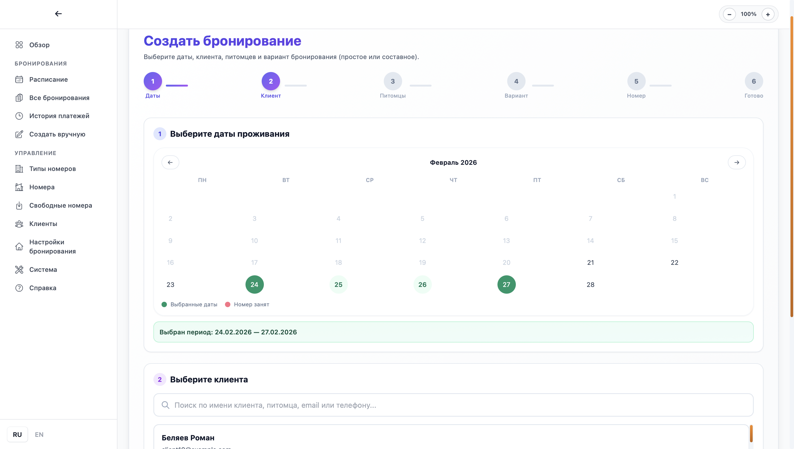

# Pet Hotel Desktop

Язык: [RU](README.md) | [EN](README_EN.md)

<div align="center">


[](https://github.com/t0nyhat/RentForPet_Desktop/actions/workflows/test.yml)
[](https://github.com/t0nyhat/RentForPet_Desktop/actions/workflows/release.yml)

**Локальное десктоп-приложение для управления зоогостиницей**

[Возможности](#возможности) • [Быстрый старт](#быстрый-старт) • [Сборка](#сборка-десктоп-приложения) • [Разработка](#разработка) • [Тестирование](#тестирование) • [CI/CD](.github/CI_CD_SETUP.md)

</div>

---

## Обзор

Pet Hotel Desktop — полностью локальное приложение для управления зоогостиницей. Работает без интернета, все данные хранятся на вашем компьютере. Не требует авторизации — сразу открывается панель управления.

### Особенности

- **Полностью локальное** — работает офлайн, данные только на вашем ПК
- **Без авторизации** — запустил и работаешь
- **Современный стек** — React + TypeScript + .NET 8
- **Кроссплатформенное** — macOS, Windows, Linux

---

## Документация

- RU: [docs/README.md](docs/README.md)
- EN: [docs/README_EN.md](docs/README_EN.md)
- В приложении: раздел `Справка / Help` (`/help`)

---

## Возможности

### Управление бронированиями
- Создание и редактирование бронирований
- Gantt-диаграмма занятости номеров
- Составные бронирования с переездами между номерами
- Автоматический расчёт стоимости
- Система скидок и предоплаты
- Статусы: Ожидание → Подтверждено → Заселён → Выселен

### Клиенты и питомцы
- База клиентов с историей бронирований
- Профили питомцев с заметками
- Дневник активности питомца
- Система лояльности со скидками

### Номера
- Типы номеров с описаниями и ценами
- Управление отдельными номерами
- Проверка доступности

### Платежи
- Несколько способов оплаты (карта, наличные, перевод)
- Возвраты и переносы оплаты между бронированиями
- Отслеживание статусов платежей

---

## Скриншоты

<div align="center">

### Расписание бронирований (Gantt-диаграмма)


### Таблица всех бронирований


### Создание нового бронирования


### Управление клиентами


### Управление номерами


</div>

---

## Технологии

| Слой | Технологии |
|------|-----------|
| **Десктоп** | Electron |
| **Фронтенд** | React 18, TypeScript, Vite, Tailwind CSS, React Query |
| **Бэкенд** | .NET 8, ASP.NET Core Web API |
| **База данных** | SQLite (локальная, создаётся автоматически) |

---

## Быстрый старт

### Требования

- [.NET 8 SDK](https://dotnet.microsoft.com/download/dotnet/8.0)
- [Node.js 18+](https://nodejs.org/)

### Установка

```bash
# Клонировать репозиторий
git clone https://github.com/t0nyhat/RentForPet_Desktop.git
cd RentForPet_Desktop

# Установить зависимости
npm install
cd frontend && npm install && cd ..
```

### Запуск

```bash
npm run dev
```

Откроется:
- Бэкенд: `http://localhost:5226`
- Фронтенд: `http://localhost:5173`

> База данных SQLite создаётся автоматически при первом запуске в папке `data/`.

### Экспорт и бэкап данных

- В разделе `Расписание` добавлена кнопка `Экспорт в Excel` (файл `.xlsx`) со всеми данными бронирований.
- Там же доступна кнопка `Бэкап БД`, которая создаёт резервную копию SQLite и скачивает файл.
- Сервер также сохраняет бэкапы в папку `data/backups/` рядом с `pethotel.db`.

---

## Сборка десктоп-приложения

### Автоматическая сборка (CI/CD) 🚀

При мердже PR в ветку `main` автоматически:
- ✅ Auto Version Bump повышает версию и создает тег `vX.Y.Z`
- ✅ Build and Release (workflow_run) запускает тесты
- 📦 Создаются сборки для всех платформ (Windows, macOS ARM, Linux)
- 🎉 Публикуется релиз на GitHub

Подробнее: [CI/CD Setup](.github/CI_CD_SETUP.md)

### Локальная сборка

```bash
# macOS (Apple Silicon)
npm run build:mac-silicon

# macOS (Intel)
npm run build:mac-intel

# Windows
npm run build:win

# Linux
npm run build:linux
```

Готовое приложение появится в папке `dist-electron/`.

Иконки берутся из `build/icons/` (`icon.icns` для macOS, `icon.ico` для Windows). Автоматическая генерация при сборке не выполняется.

---

## Структура проекта

```
petshoteldesktop/
├── frontend/                 # React + TypeScript
│   └── src/
│       ├── components/       # UI компоненты
│       ├── pages/            # Страницы
│       └── context/          # React контексты
├── PetHotel.API/             # ASP.NET Core Web API
│   └── Controllers/          # API эндпоинты
├── PetHotel.Application/     # Бизнес-логика
│   ├── DTOs/                 # Data Transfer Objects
│   └── Services/             # Сервисы
├── PetHotel.Domain/          # Сущности и интерфейсы
├── PetHotel.Infrastructure/  # Доступ к данным
│   └── Data/                 # EF Core DbContext
├── PetHotel.Tests/           # Backend тесты (xUnit)
├── main.js                   # Electron
└── data/                     # База данных SQLite
```

---

## Разработка

### Команды

```bash
# Запуск в режиме разработки
npm run dev

# Только фронтенд
npm run dev:react

# Только бэкенд
npm run dev:dotnet

# Сборка
npm run build:mac-silicon   # macOS Apple Silicon
npm run build:mac-intel     # macOS Intel
npm run build:win           # Windows
```

### Фронтенд

```bash
cd frontend
npm run dev          # Dev сервер
npm run build        # Production сборка
npm run lint         # ESLint
npm run type-check   # TypeScript проверка
npm test             # Запуск тестов
```

### Бэкенд

```bash
dotnet run --project PetHotel.API              # Запуск
dotnet watch run --project PetHotel.API        # Hot reload
dotnet build PetHotel.sln                      # Сборка
dotnet test PetHotel.Tests                     # Запуск тестов
```

### Тестирование

Проект включает полный набор тестов для frontend и backend.

**Статистика тестов:**
- Frontend: 71 тест (5 тестовых файлов)
- Backend: 126 тестов (xUnit)
- **Всего: 197 тестов**

#### Frontend тесты

```bash
cd frontend

npm test              # Vitest в watch mode
npm run test:run      # Запуск всех тестов
npm run test:coverage # С покрытием кода
npm run test:ui       # UI интерфейс для тестов
```

Тесты покрывают:
- React компоненты (Modal, AlertModal, ConfirmModal)
- Утилиты форматирования данных
- Работу с localStorage

#### Backend тесты

```bash
dotnet test PetHotel.Tests                     # Запуск всех тестов
dotnet test PetHotel.Tests --verbosity normal  # С подробным выводом
dotnet test --collect:"XPlat Code Coverage"    # С покрытием кода
```

Тесты покрывают:
- Domain entities и бизнес-логика
- Application services и валидаторы
- Exception handling

#### Pre-commit hooks

Тесты автоматически запускаются перед коммитом через Husky:
- ✅ Frontend: lint, type-check, тесты
- ✅ Backend: StyleCop, build, тесты (только для измененных C# файлов)

Пропустить проверки:
```bash
git commit --no-verify
```

---

## Конфигурация

### Переменные окружения

| Переменная | Описание | По умолчанию |
|------------|----------|--------------|
| `PETSHOTEL_DATA_PATH` | Путь к папке с БД | `./data` |

### Настройки бэкенда

`PetHotel.API/appsettings.json`:

```json
{
  "ConnectionStrings": {
    "DefaultConnection": "Data Source=./data/PetHotel.db"
  },
  "Seed": {
    "Enabled": true
  }
}
```

При `Seed.Enabled: true` создаются тестовые данные: типы номеров, номера, тестовый клиент с питомцами и бронирование.

---

## Лицензия

MIT License — см. [LICENSE](LICENSE)

---


<div align="center">

**RentForPet** 🐾

</div>
