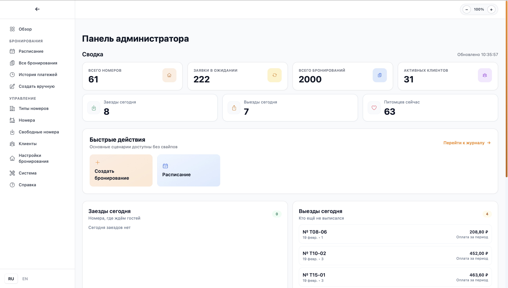
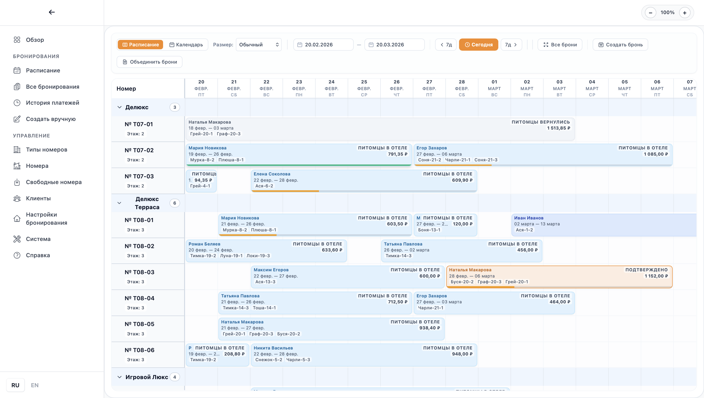
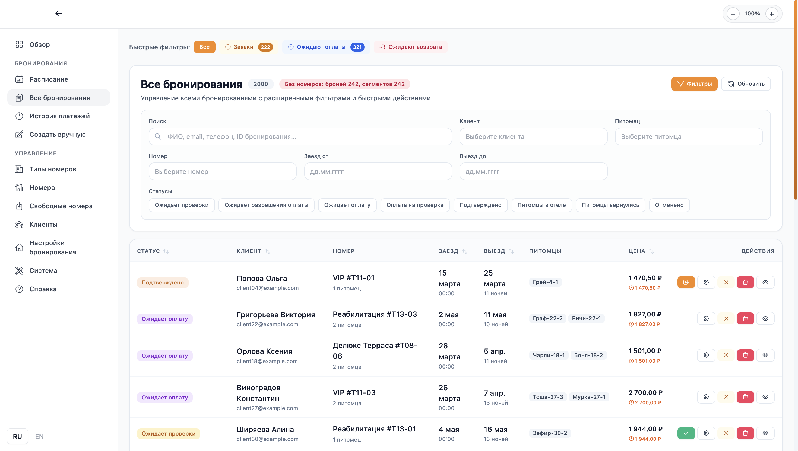
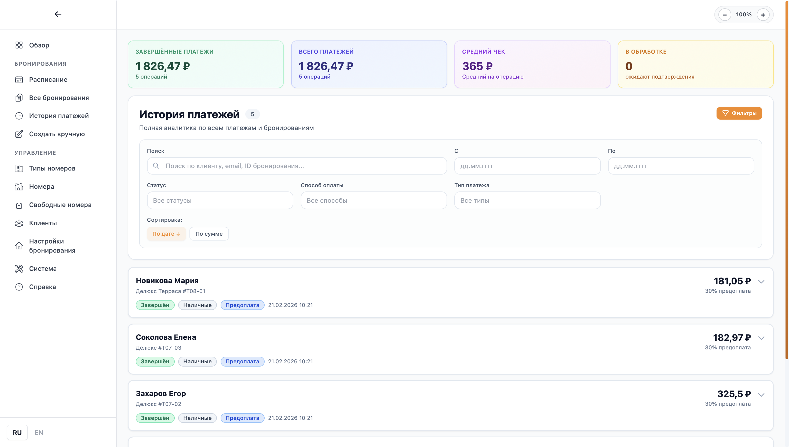
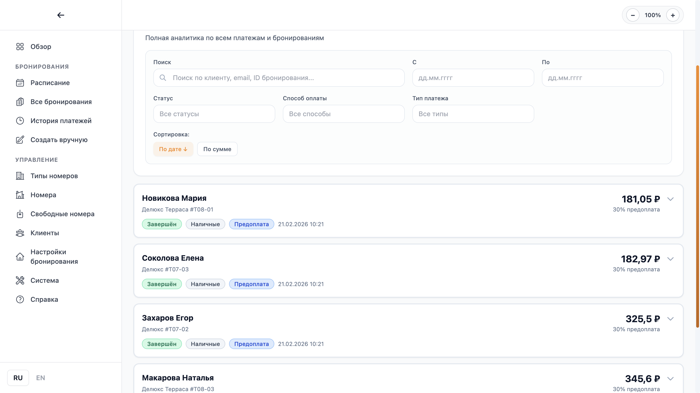
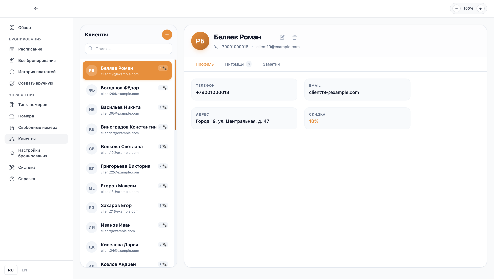
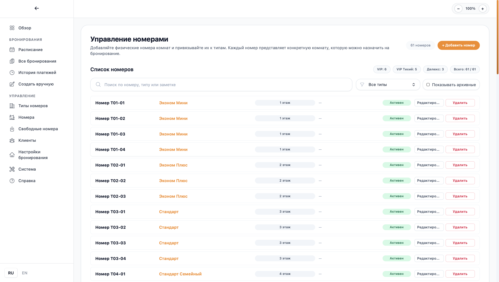

# Feature Overview

## 1. Main Admin Navigation

The admin panel includes these core sections:

- Overview
- Schedule
- All Bookings
- Payment History
- Create Manual Booking
- Room Types
- Rooms
- Available Rooms
- Clients
- Booking Settings

## 2. Bookings

### 2.1 Schedule (Gantt + Calendar)

- Booking timeline by room and date
- Date range controls
- Display scale modes
- Create booking directly from schedule
- Merge bookings
- Update dates, assign room, move booking by room/date

### 2.2 All Bookings Journal

- Full bookings table
- Search by client/pet/room
- Quick status filters
- Date range filtering
- Sorting and pagination
- Booking actions:
  - Confirm
  - Check-in
  - Check-out
  - Cancel
  - Delete
  - Assign room
  - Update dates

### 2.3 Manual Booking Creation

- Select client and pets
- Pick stay dates
- Automatic accommodation options
- Composite options with room transfers
- Loyalty discount support

## 3. Payments and Finance

### 3.1 Payment History

- Complete payment list
- Filters by status/method/type/date
- Search by client, booking, transaction
- Payment detail view

### 3.2 Payment Operations Inside Booking

- Prepayment and full payment
- Edit prepayment amount
- Cancel prepayment
- Process refund
- Transfer overpayment to another booking
- Convert overpayment
- View/print receipt

## 4. Clients and Pets

- Client base with search
- Create/update/delete client
- Loyalty discount per client
- Client pet cards
- Create/update/delete pet
- Internal notes for client and pet

## 5. Inventory (Rooms)

### 5.1 Room Types

- Create and edit room types
- Price per stay unit
- Additional pet price
- Capacity, area, features
- Activate/archive room type

### 5.2 Rooms

- Add and edit physical rooms
- Map room to room type
- Search and filtering
- Active/archived room handling

### 5.3 Available Rooms

- Find available rooms for date range
- Account for number of pets
- Group results by room type
- Pre-calculate price for selected period

## 6. Booking Settings

- Calculation mode: days or nights
- Check-in and check-out time
- Protection when changing settings with active bookings

## 7. Export and Backup

- Export schedule to Excel (`.xlsx`)
- Create SQLite database backup

