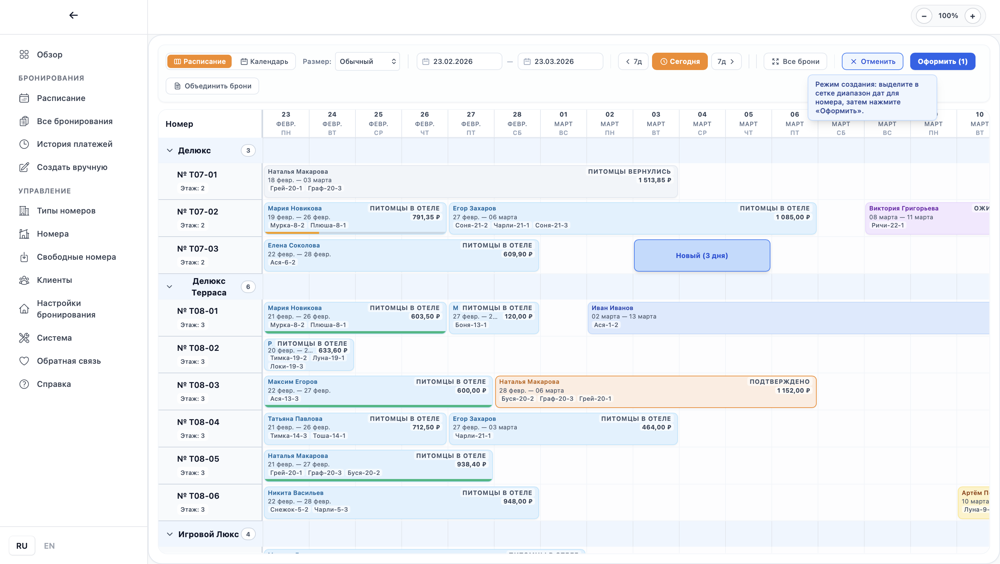
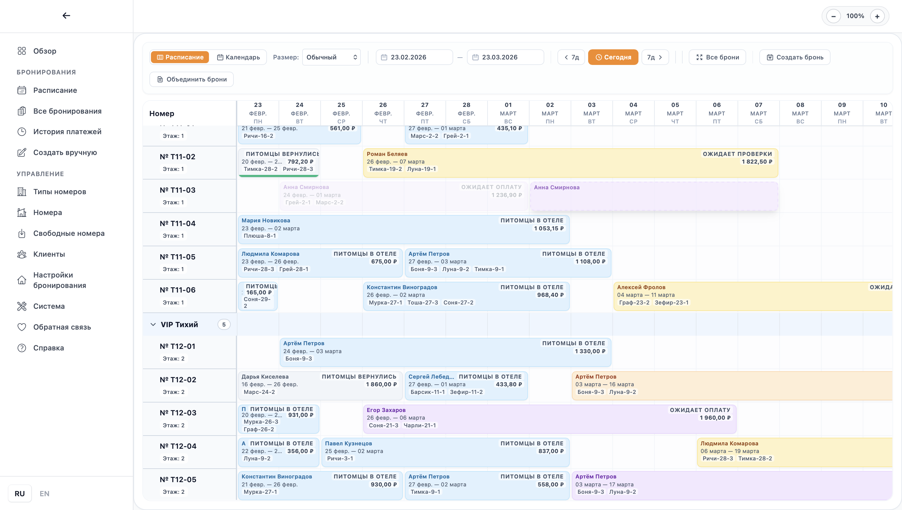
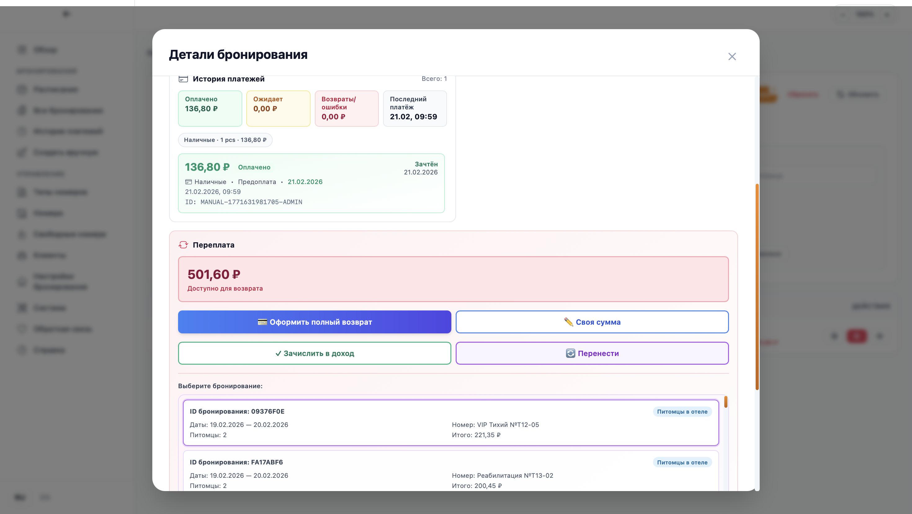
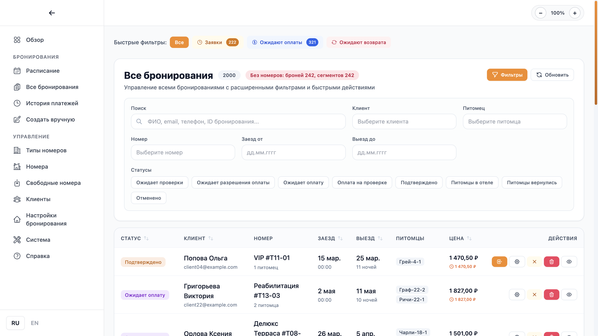

# Workflows

## 1. Create a New Booking Quickly

1. Open `Create Manual Booking`.
2. Find a client and select pets.
3. Set check-in/check-out dates.
4. Choose one of the suggested options.
5. Confirm creation.

## 2. Check In a Client

1. Open `All Bookings`.
2. Find a booking with `Confirmed` status.
3. Click `Check-in`.
4. Add payment if needed.

## 3. Drag Booking Bar in Schedule

1. Open `Schedule`.
2. Find the booking bar you need.
3. Drag it to the target dates or another room.
4. Confirm the room/date update in the modal.

## 4. Composite Booking (with Transfers)

1. Open `Create Manual Booking`.
2. Select client, pets, and stay dates.
3. Choose a composite option (multiple segments).
4. Verify segments and total price.
5. Confirm creation.

## 5. Transfer Payment to Another Client Booking

1. Open booking details with overpayment.
2. Click `Transfer Payment`.
3. Select the target booking of the same client.
4. Enter transfer amount and confirm.

## 6. Process Refund

1. Open booking details that have an amount to refund.
2. Click `Process Refund`.
3. Review the suggested amount (adjust if needed).
4. Confirm the refund operation.

## 7. Check Out and Close Payment

1. Open booking details.
2. Verify remaining balance or overpayment.
3. Perform needed operation: additional payment, refund, overpayment transfer.
4. Click `Check-out`.

## 8. Add a New Room Type and Room

1. Open `Room Types` and create a type.
2. Set price, capacity, area, and features.
3. Open `Rooms`.
4. Add a room and assign its type.

## 9. Create a Backup

1. Open `Schedule`.
2. Click `Database Backup`.
3. Save the generated backup file.

